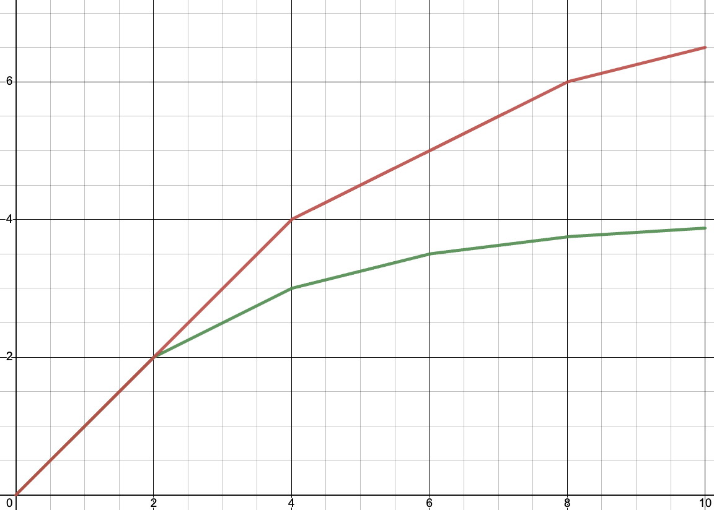
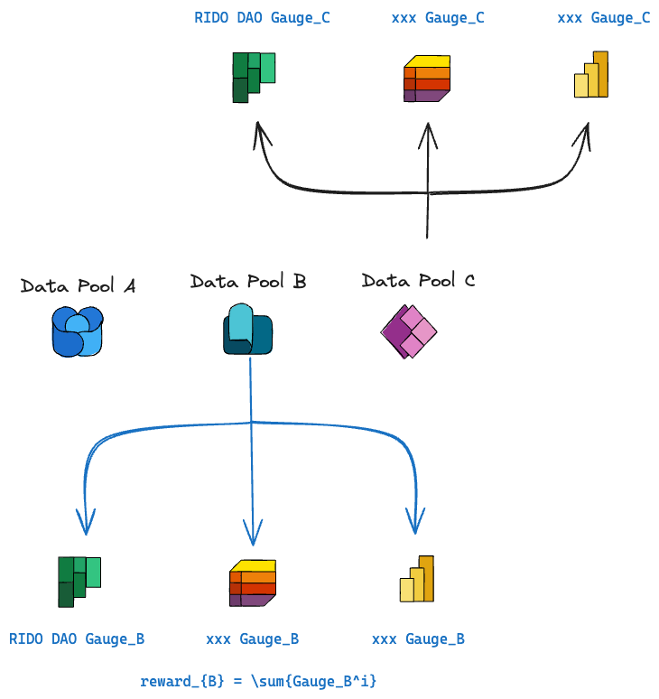
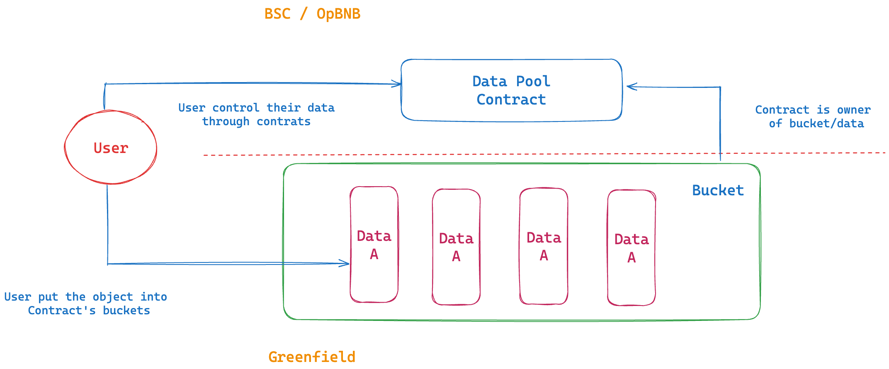
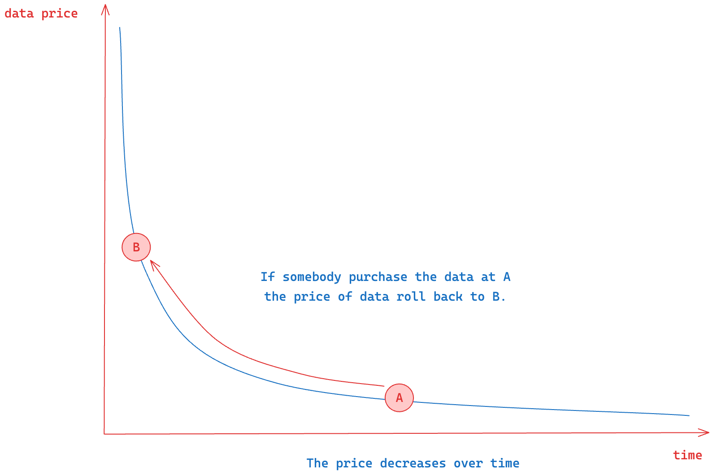

# RIDO DAO Contracts

Vyper contracts used in the RIDO Governance DAO.

## Overview

**RIDO** is an *Data Mining platform* which promote producers to generate constructed personal data (on-chain or off-chain) that can be shared in anywhere.

**RIDO** is an *Data Trading protocol* which bundled the data under the same type into data pool and consumers can purchase data directly from data pool. RIDO speeds up the flow of data and helps users extract value from their data.

The data RIDO deal with should be registered in [BAS](https://doc.bascan.io). And the development of RIDO has 4 stages:

1. Focus on how to allocate incentive/income in the same data pool.
2. Focus on how to allocate incentive between different data pools.(RIDO DAO)
3. Focus on helping users regain control of access to their data.
4. A trading protocol which focus on how to price data.

### Definition

- **Data Pool**: The data ([attestation](https://doc.bascan.io/core_concept/attestation)) under the same type ([schema](https://doc.bascan.io/core_concept/schema)) make a data pool.

- **Epoch**: A unit of time. The incentive and parameter changes are based on epoch.

--------

## Stage 1: Allocate Incentive in the Single Data Pool

Stage one is also Airdrop Stage or Test Stage in which RIDO provide XP (ERC20 on BSC) for users according to the data their generated. And users can get airdrop according to the amount their XP before stage 2.

In this stage, RIDO DAO decide how much XP provided and data pools params for each data pool. So the core of Stage 1 is how to allocate the XP provided to a data pool.

The basic logic of RIDO is that the more data user generated the more reward the user should earn. But different from providing liquid, the generation of data is resource-free and very cheap. To avoid users junk data to earn reward, in RIDO, with the increase of generated data, the marginal return of reward for a user decreases.

Now let's go into some detail.

First of all we have a function as following:

$$
f(s,x_j)=\begin{cases}
x_j,& 0 \leq x_j < s;\\
s+\frac{1}{t} \cdot (x_j-s) ,& s \leq x_j < s+1;\\
... \\
s \cdot \sum_{m=0}^{n-1} (\frac{1}{t})^m + (\frac{1}{t})^n \cdot (x_j-ns), & ns \leq x_j < (n+1)s
\end{cases}
$$

where $x_j$ is the amount of data created by user $j$, $t$ and $s$ is data pool params.

<div align="center" id="func">
    
</div>

As fig illustrating, the $s$ & $t$ of red line is 4 & 2 respectively, and the $s$ & $t$ of green line is 2 & 2.

According to the formula, with the increase of $x_j$, the increase rate of $f$ becomes slower and eventually converges to $\frac{s}{1-1/t}$.

The amount of data under different type should be different. For example, the data of a user's profiles is updated once a week could be normally but users can generate dozens of game battles record data in a day. So as for different kind of data, the params of data pools should also be changed.

Ultimately, the quantity of XP obtained by user `j` is:

$$
S_i^j = S_i \cdot \frac{f(s,x_j)}{\sum_j{x_j}}
$$

where $S_i$ represents the total XP (experience points) amount for Data Pool $i$.

### Stage 2: Governance: Allocate Incentive Between Data pools

The value of data is ambiguous. The value of data varies based on factors such as data type, time, and user. Therefore, the incentive for different types of data needs to be dynamically adjusted based on different conditions. In stage 1, the quantity of incentive for different types of data is specified by RIDO DAO. However, this approach is prone to centralization pitfalls or may lack fairness, being unable to maximally stimulate users to generate data.Therefore, we need a more decentralized and equitable approach to determine rewards for different data under various conditions.

RIDO utilizes veToken model and employs DAO governance to address this issue.

As mentioned earlier, incentives are distributed per epoch, and the total number of tokens issued in each epoch is predetermined and decreases over time. Therefore, our question becomes how to determine the proportion of tokens that different data pools should receive in each epoch.

To solve this problem, we import some new definitions：

- Gauge Type: A metric used to represent a certain aspect of a Data Pool. Analogous to considerations like cost-effectiveness in phone reviews, camera pixels, and battery life.
- Gauge Type Weight: The weight that different Gauge Types carry in evaluating the importance of a data pool. Drawing an analogy to smartphones, the importance of cost-effectiveness accounts for 60%, battery life for 20%, design for 10%, and pixel quality for 10%. For ease of writing, we use $w_k$ to represent the weight of Gauge Type $k$ in the subsequent text. And $\sum_{k} w_k = 1$
- Gauge: The overall importance indicator of a specific data pool. $Gauge_i$ represents the gauge of data pool $i$. Additionally, we have $\sum Gauge_i = 1$.
- Inner Gauge: The score of a particular data pool under a specific Gauge Type. It is used to indicate the performance of a data pool under a certain Gauge type. $IGauge_i^k$ represents the Inner Gauge of data pool $i$ under Gauge Type $k$. $\sum_{i \in pools} IGauge^k_i = 1$.

We introduce an intermediate variable $Gauge^k_i = w_k \times inner\_gauge^k_i\), where \(Gauge^k_i = w_k \cdot IGauge^k_i$ , and  $Gauge_i = \sum_{k} Gauge^k_i$.

Finally, the incentive allocated to data pool `i` is:

$$
S_i = S \cdot Gauge_i
$$

<div align="center" id="gauge">
    
</div>

Up to this point, the remaining question becomes how to determine the Gauge Type, Gauge Type Weight, and Inner Gauge. This process is specifically implemented through DAO governance.

RIDO DAO determines the types of Gauge Type, Gauge Weight, and the calculation method of Inner Gauge through voting.

Examples of Gauge Type:

| Gauge Type     | Calculate Inner Gauge|
|:---------------|:--------------------|
|RIDO DAO Gauge  | $IGauge_i = \frac{v_i}{v}$ where $v_i$ is the vote to data pool i and v is total vote |
|Trading Gauge   | $IGauge_i = \frac{volume_i}{volume}$ where $volume_i$ is the volume of data pool i and volume is total volume of all data pools|
|Data Size Gauge | $IGauge_i = \frac{s_i}{s}$ where $s_i$ is the volume of data pool i and volume is total size of all data pools|

RIDO DAO can dynamically adjust how to modify the Gauge System to ensure fair distribution of data based on actual context. Once the calculation method for Inner Gauge is determined, RIDO DAO cannot directly manipulate its final results (e.g., RIDO DAO cannot directly manipulate the volume of data pool), ensuring the decentralization and fairness of the system

### Stage 3: Support Private Data & User can Control Access Permission for Their Data

Firstly, it's essential to clarify that public data and data under user control completely have no transaction value.

In Web3, whether it's On-chain data or decentralized storage data like IPFS, Arweave, Ceramic, etc., the data is public. Public data is directly accessible by anyone, eliminating the need for buyers to purchase data. Most on-chain data platforms sell processed data derived from public sources, but the original data providers often do not receive compensation.

In RIDO, what is traded is the access control permissions to the data. If users can modify or delete their data after selling access rights, there is no motivation for anyone to buy user data.

To address these issues, RIDO uses Greenfield as the underlying storage to achieve data privacy. By transferring data ownership to contracts, RIDO ensures user permissions are within reasonable bounds

<div align="center" id="gauge">
    
</div>

As shown in the diagram, the basic workflow for users is as follows:

- Contract creates a bucket and become the owner.
- USer store data in the bucket held by the contract and obtain access control permissions for their own data.
- USer control access permissions for their data on the Binance Smart Chain (BSC) or OpBNB through the contract.

More detail: Coming Soon.

### Stage 4: Data Trading Protocol

Data is a non-standardized product, and various factors such as different data types, sizes of data sets, time points, and the complexity of data ownership make data pricing extremely challenging. RIDO employs a dynamic S-curve approach for data pricing. The data price starts from a certain value, decreases over time, and if a buyer purchases data at a certain moment, the pricing function rolls back.

<div align="center" id="gauge">
    
</div>

More detail: Coming Soon.

## Development

### Dependencies

- `python3` from version 3.8 to 3.11
- [apx](https://docs.apeworx.io/ape/stable/userguides/quickstart.html) verison 0.7 or upper

### Setup

```shell
git clone git@github.com:ridoio/rido-dao-contract.git
cd  rido-dao-contract
```

### Add deploy account

```shell
ape account imports ${alia}
```

### Deploy contract

```shell
ape run deploy --network=bsc:testnet:geth
```

## Contract Address

Following is the contract deployed in BNB chain.

### BSC Testnet

- *Stage1 Minter*: [`0x57C3c41eD1d8d217B9F05d1e1628f58D0106A7C1`](https://testnet.bscscan.com/address/0x57C3c41eD1d8d217B9F05d1e1628f58D0106A7C1)
- *Stage1 Data Pool*: [`0x315c1Caa4b9904ee852aDd9FCb03a2CF0a91cE69`](https://testnet.bscscan.com/address/0x315c1Caa4b9904ee852aDd9FCb03a2CF0a91cE69)
- *RIDOC BRC20*: [`0x6344F907bCc8fE4f98B853403C79eec36665EF82`](https://testnet.bscscan.com/address/0x6344F907bCc8fE4f98B853403C79eec36665EF82)
