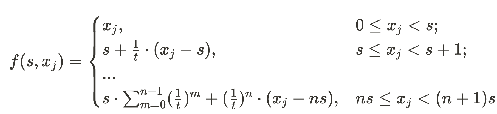

# RIDO DAO Contracts

Vyper contracts used in the RIDO Governance DAO.

## Overview

**RIDO** is an *Data Mining platform* which promote producers to generate constructed personal data (on-chain or off-chain) that can be shared in anywhere.

**RIDO** is an *Data Trading protocol* which bundled the data under the same type into data pool and consumers can purchase data directly from data pool. RIDO speeds up the flow of data and helps users extract value from their data.

The data RIDO deal with should be registered in [BAS](https://doc.bascan.io). And the development of RIDO has 4 stages:

1. Focus on how to allocate incentive/income in the same data pool.
2. Focus on how to allocate incentive between different data pools.(RIDO DAO)
3. Focus on helping users regain control of access to their data.
4. A trading protocol which focus on how to price data.

### Definition

- **Data Pool**: The data ([attestation](https://doc.bascan.io/core_concept/attestation)) under the same type ([schema](https://doc.bascan.io/core_concept/schema)) make a data pool.

- **epoch**: A unit of time. The incentive and parameter changes are based on epoch。

## Stage 1

Stage one is also Airdrop Stage or Test Stage in which RIDO provide XP (ERC20 on BSC) for users according to the data their generated. And users can get airdrop according to the amount their XP before stage 2.

In this stage, RIDO DAO decide how much XP provided and data pools params for each data pool. So the core of Stage 1 is how to allocate the XP provided to a data pool.

The basic logic of RIDO is that the more data user generated the more reward the user should earn. But different from providing liquid, the generation of data is resource-free and very cheap. To avoid users junk data to earn reward, in RIDO, with the increase of generated data, the marginal return of reward for a user decreases.

Now let's go into some detail.

First of all we have a function as following:



where `x_j` is the amount of data created by user `j`, `t` and `s` is data pool params. 


As fig illustrating, the `s` & `t` of red line is 4 & 2 respectively, and the `s` & `t` of green line is 2 & 2.

According to the formula, with the increase of `x_j`, the increase rate of `f` becomes slower and eventually converges to st/t-1.

The amount of data under different type should be different. For example, the data of a user's profiles is updated once a week could be normally but users can generate dozens of game battles record data in a day. So as for different kind of data, the params of data pools should also be changed.

## Development

### Dependencies

- `python3` from version 3.8 to 3.11
- [apx](https://docs.apeworx.io/ape/stable/userguides/quickstart.html) verison 0.7 or upper

### Setup

```shell
git clone git@github.com:ridoio/rido-dao-contract.git
cd  rido-dao-contract
```

### Add deploy account

```shell
ape account imports ${alia}
```

### Deploy contract

```shell
ape run deploy --network=bsc:testnet:geth
```
